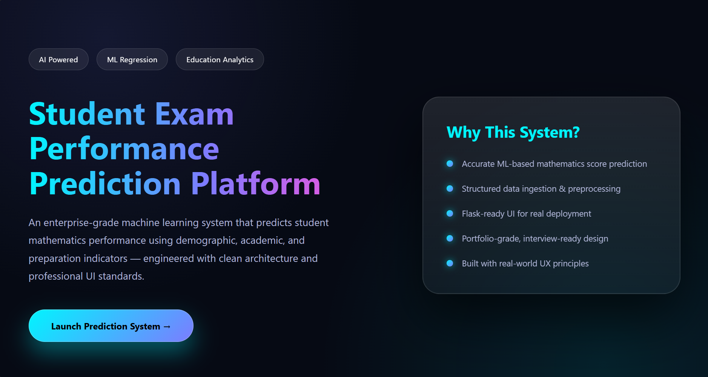

# 🤹End to End Machine Learning Project on Student Performance

## Index Page



## Home Page


🧠 HOW the Model is Actually Predicting

Your model is trained on historical student data and has learned patterns like:

- Reading score ↑ → Math score ↑
- Writing score ↑ → Math score ↑
- Test preparation completed → better score
- Lunch type → impacts performance
- Education level → indirect correlation

🧩 Full Prediction Flow

```bash
User Input
   ↓
DataFrame
   ↓
Preprocessing (encoding + scaling)
   ↓
Model Loaded
   ↓
Model.predict()
   ↓
Math Score Output
```
